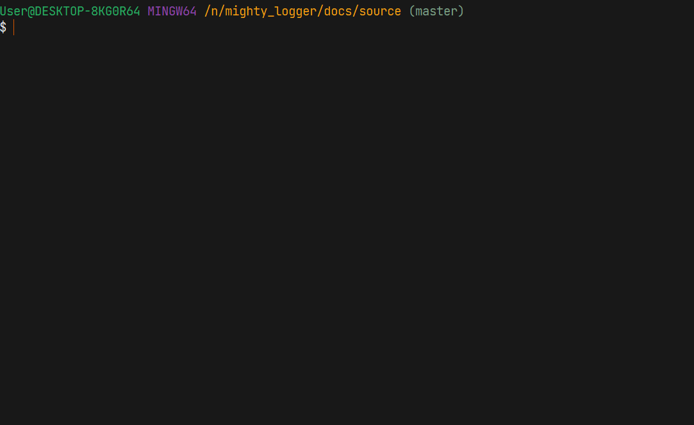

Example
=======

.. code-block:: python
	:linenos:

	from time import sleep

	from mighty_logger import MightyLogger
	from mighty_logger.src import IndefiniteAnimations, DefiniteAnimations, LoggerEntryTypes, ProcessEntryTypes, LogEnvironments, SortingKeys, SelectionTypes, GetAnsiFormat, AnsiColor

	if __name__ == "__main__":
		logger = MightyLogger(program_name="Installer", log_environment=LogEnvironments.CONSOLE, console_width=115)
		logger.empty(f"{AnsiColor('CHOCOLATE', 'foreground')}{GetAnsiFormat('underline/on')}Program installation logging {GetAnsiFormat('bold/on')}starts{GetAnsiFormat('reset/on')}")
		logger.publish_author()

		logger.start_timer("Timer started")
		logger.entry(LoggerEntryTypes.message, "Program installation started")

		sleep(1)
		logger.start_indefinite_process("File upload", IndefiniteAnimations.SuperSpace)
		sleep(2)
		logger.note_process(ProcessEntryTypes.achievement, "Files downloaded")
		sleep(3)
		logger.progress_rise(100)
		logger.stop_process("Files unzipped")

		logger.entry(LoggerEntryTypes.warning, "Newer version found")
		logger.timer_mark("Timer mark")

		logger.separator()

		data = logger.getty("Enter password: ")

		sleep(1)
		logger.start_definite_process("Installing files", DefiniteAnimations.Arrow)
		sleep(0.6)
		logger.progress_rise(3)
		sleep(0.4)
		logger.progress_rise(7)
		sleep(0.3)
		logger.progress_rise(14)
		sleep(0.5)
		logger.progress_rise(16)
		sleep(1.1)
		logger.progress_rise(19)
		sleep(1.5)
		logger.progress_rise(25)
		sleep(1.4)
		logger.progress_rise(35)
		sleep(1.4)
		logger.progress_rise(45)
		sleep(1.6)
		logger.progress_rise(46)
		sleep(1.1)
		logger.progress_rise(47)
		logger.note_process(ProcessEntryTypes.milestone, "Files prepared")
		sleep(3.7)
		logger.progress_rise(76)
		sleep(1.5)
		logger.progress_rise(77)
		sleep(1.4)
		logger.progress_rise(79)
		sleep(1.1)
		logger.progress_rise(81)
		sleep(1.2)
		logger.progress_rise(82)
		sleep(1.3)
		logger.progress_rise(85)
		sleep(0.8)
		logger.note_process(LoggerEntryTypes.error, "Incompatibility found")
		sleep(1.3)
		logger.note_process(LoggerEntryTypes.resolved, "Incompatibility eliminated")
		sleep(1.1)
		logger.progress_rise(86)
		sleep(0.6)
		logger.progress_rise(87)
		sleep(0.9)
		logger.progress_rise(88)
		sleep(0.9)
		logger.progress_rise(89)
		sleep(0.9)
		logger.progress_rise(90)
		sleep(1.4)
		logger.progress_rise(91)
		sleep(1.8)
		logger.progress_rise(97)
		sleep(1.5)
		logger.progress_rise(100)
		sleep(1.3)
		logger.stop_process("Program installed")

		logger.stop_timer("Timer completed")
		logger.empty(data)

		logger.sort(SortingKeys.SORT_ON_TYPE)
		logger.entry(LoggerEntryTypes.info, "Logger sorted")

		logger.export_to_csv("export_logs")

		logger.savy("log", False)

